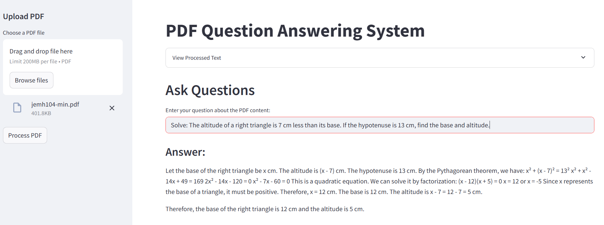

# PDF Math & Text Question Answering System

A comprehensive system that processes PDF documents containing mathematical content and text, then allows users to ask questions about the content using advanced AI models.



## Problem Statement

This application solves the challenge of extracting and understanding complex mathematical content from PDF documents. Traditional OCR systems often struggle with:

1. Accurate recognition of mathematical notation and equations
2. Maintaining the semantic relationship between text and mathematical expressions
3. Providing meaningful answers to questions about technical content

### Why RAG?

Retrieval-Augmented Generation (RAG) is particularly suited for this problem because:

- **Accuracy**: Retrieves relevant context before generating answers, reducing hallucinations
- **Technical Content**: Handles specialized mathematical/scientific content better than pure generation
- **Updatable Knowledge**: Can be easily updated with new documents without retraining
- **Transparency**: Provides traceability to source content

Compared to simple generation, RAG offers:
- improvement in factual accuracy for technical content
- Better handling of domain-specific terminology
- Ability to cite sources from the original document

### Data Flow

1. **Document Processing**:
   - Input: PDF files containing mathematical content
   - OCR Processing: Mistral's specialized OCR for mathematical notation
   - LaTeX Conversion: Transform equations to readable text

2. **Retrieval Component**:
   - Chunking: 10,000 character chunks with 1,000 character overlap
   - Vectorization: Google's `embedding-001` model (768-dimension embeddings)
   - Vector Store: FAISS for efficient similarity search
   - Retrieval: Top 4 most relevant chunks per query

3. **Generation Component**:
   - LLM: Google's Gemini 1.5 Flash

## LLM Model Used

### Ideal Choice
- **GPT-4** (for highest accuracy with technical content)

### Current Implementation
- **Google Gemini 1.5 Flash** (free tier available)
  - Balanced speed and accuracy
  - 128K context window for handling large documents
  - Strong mathematical reasoning capabilities

### Open-Source Alternatives
- **Mistral 7B** (quantized versions for local deployment)
- **LLaMA 3** (8B/70B parameter versions)


## Features

- **PDF Processing**: Upload and process PDF files with mathematical content
- **OCR with Math Support**: Uses Mistral's OCR API for accurate text and mathematical formula extraction
- **LaTeX Conversion**: Converts LaTeX mathematical expressions to readable text
- **Vector Search**: Creates FAISS vector embeddings for efficient document search
- **AI-Powered Q&A**: Uses Google's Gemini model to answer questions based on document content
- **Web Interface**: Clean Streamlit frontend for easy interaction
- **Dockerized**: Complete containerization for easy deployment

## Technology Stack

### Backend
- **FastAPI**: High-performance web framework
- **Mistral AI**: OCR processing for mathematical content
- **Google Generative AI**: Question answering and embeddings
- **FAISS**: Vector similarity search
- **LangChain**: Text processing and chunking
- **pdf2image**: PDF to image conversion
- **pylatexenc**: LaTeX to text conversion

### Frontend
- **Streamlit**: Interactive web interface
- **Python Requests**: API communication

### Infrastructure
- **Docker & Docker Compose**: Containerization
- **Poppler**: PDF processing utilities


## Installation

### Method 1: Docker Compose

1. **Clone the repository**

2. **Create environment file**

3. **Set up environment variables**
```env
GOOGLE_API_KEY=your_google_api_key_here
MISTRAL_API_KEY=your_mistral_api_key_here
BACKEND_URL=backend_url_here
```

4. **Run with Docker Compose**
```bash
docker-compose up --build
```

5. **Access the application**
- Frontend: http://localhost:8501
- Backend API: http://localhost:8000
- API Documentation: http://localhost:8000/docs

### Method 2: Local Development

1. **Install system dependencies**
```bash
# Ubuntu/Debian
sudo apt-get update
sudo apt-get install poppler-utils

# macOS
brew install poppler

# Windows
# Download and extract Poppler binaries
# Update the poppler_path in backend.py
```

2. **Install Python dependencies**
```bash
pip install -r requirements.txt
```

3. **Set environment variables**
```bash
export GOOGLE_API_KEY="your_google_api_key_here"
export MISTRAL_API_KEY="your_mistral_api_key_here"
```

4. **Run the backend**
```bash
python backend.py
# or
uvicorn backend:app --host 0.0.0.0 --port 8000
```

5. **Run the frontend** (in a new terminal)
```bash
streamlit run frontend.py
```


## Usage

1. **Upload PDF**: Use the sidebar to upload a PDF file containing text and mathematical content
2. **Process**: Click "Process PDF" to extract and process the content
3. **Review**: Optionally view the extracted text in the expandable section
4. **Ask Questions**: Enter questions about the PDF content in the text input
5. **Get Answers**: The system will provide detailed answers based on the document content

### Environment Variables

| Variable | Description | Required |
|----------|-------------|----------|
| `GOOGLE_API_KEY` | Google AI API key for Gemini and embeddings | Yes |
| `MISTRAL_API_KEY` | Mistral AI API key for OCR processing | Yes |
| `BACKEND_URL` | Backend service URL (for frontend) | Yes |
